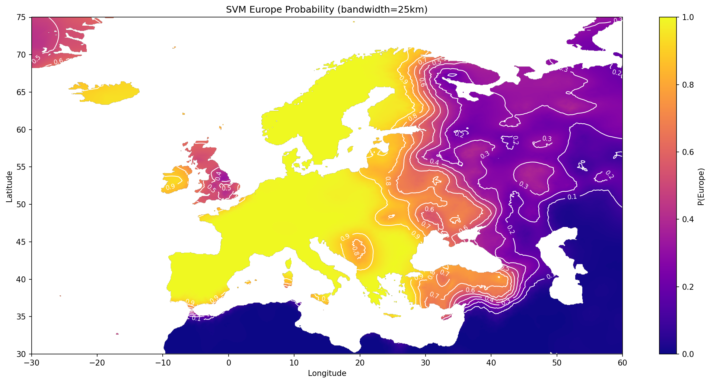

# Europe or Not?

> "What constitutes continental Europe is intersubjective. Let's extract it from embeddings."

This project attempts to define the boundaries of Europe not by geography or politics alone, but by the "latent space" of city embeddings. By training a classifier on the embeddings of thousands of cities—labeled simply as "Europe" or "Not Europe"—we can visualize what the model perceives as the "European" essence.

## The Result

The map below shows the probability contours of a location being "Europe" according to an SVM trained on city embeddings.



*   **Yellow**: High probability of being Europe.
*   **Purple**: High probability of being Non-Europe.
*   **Contours**: Show the gradient of certainty. The sharp transitions (e.g., at the Mediterranean) indicate clear distinction, while gradients (e.g., towards Russia) show more ambiguity.

**Methodology:**
1.  **Embeddings**: We generate vector embeddings for thousands of cities using OpenAI's embedding model.
2.  **Classification**: We train an SVM classifier on these vectors.
3.  **Adaptive Scoring**: We score every pixel on the map using a kernel density estimate with **adaptive bandwidth** (halved distance to the 10th nearest neighbor), allowing for sharp borders in dense areas and smooth transitions in sparse ones.

## Usage

The project is built with Python and managed by `uv`.

### 1. Setup
Install dependencies:
```bash
uv sync
```

### 2. Data Collection
(Optional) Download initial city data:/cities.db` is included in the repo, so you can render the maps immediately:

```bash
# Render all maps (heatmap, binary, contours)
uv run python scripts/render_map.py --full
```

### 3. Re-run Data Collection (Optional)
If you want to build the database from scratch:

```bash
uv run python scripts/download_cities.py
uv run python scripts/fill_coverage_gaps.py
uv run python scripts/collect_embeddings.py
```
